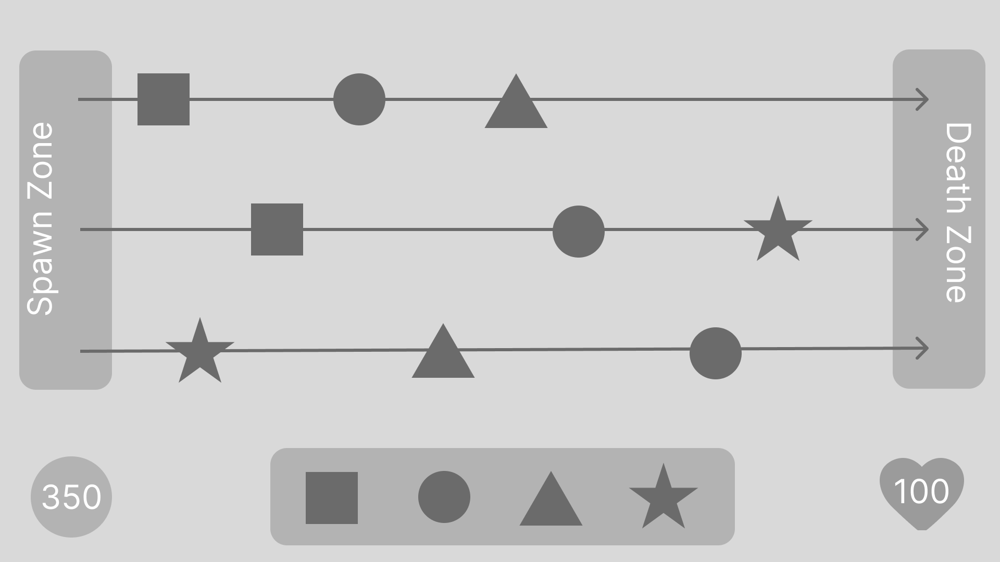

# Тестовое задание

## Особенности решения
Использовались следующие дополнительные инструменты:
* [R3](https://github.com/Cysharp/R3)
* [UniTask](https://github.com/Cysharp/UniTask)
* [DOTween](https://dotween.demigiant.com/index.php)
* [Zenject](https://github.com/modesttree/Zenject)
* Addressables

## Примечания
Настройка стартовых параметров происходит в ScriptableObject (Asses/Content/Scriptables/GameSettings.asset)

## Технические требования
* Unity 6000.1.11f1
* Universal 2D Template
* Использовать Unlit шейдеры для спрайтов
* Ориентация сцены - Landscape
* Спавн реализовать используя паттерн "фабрика";
* Взаимодействие между объектами реализовать используя паттерн "шина событий";

## Макет

## Описание механики
* Фигуры движутся слева направо с линейной скоростью;
* Если перетащил фигуру в верный слот - фигура исчезает в этом слоте, игрок получает 1 очко;
*  Если перетащил фигуру в неверный слот - фигура взрывается, у игрока отнимается 1 жизнь;
* Если взяли фигуру и отпустили не попав ни в один слот, фигура возвращается в место откуда взяли и летит дальше с прежней скоростью;
* Если фигура добралась до правого края - она взрывается, у игрока отнимается 1 жизнь;
* Фигуры могут двигаться с разной скорость, игрок начав тащить может задержать движение фигуры, как следствие фигуры могут наложиться друг на друга на лайне, такая ситуация допустима, обрабатывать ее как то особенно не нужно.

## Победа и поражение
* Игрок побеждает, когда все фигуры закончиись(отсортированы или взорваны) и количество жизней игрока больше 0;
* Игрок проигрывает, когда его здоровье становится равно 0.

## Что оценивается
* CodeStyle
* Умение строить архитектуру
* Умение использовать паттерны проектирование
* Умение подбирать арты
* Анимации и FX

## Будет плюсом
* Использование DI фреймворка Zenject
* Применение паттернов async\await
* Начальная настройка параметров игры, чтобы играть было интересно
* Если будут арты, а не на кубиках
* Применение аниматора и эффектов частиц. Имеется в виду уместное применение, чтоб красиво и со вкусом.
